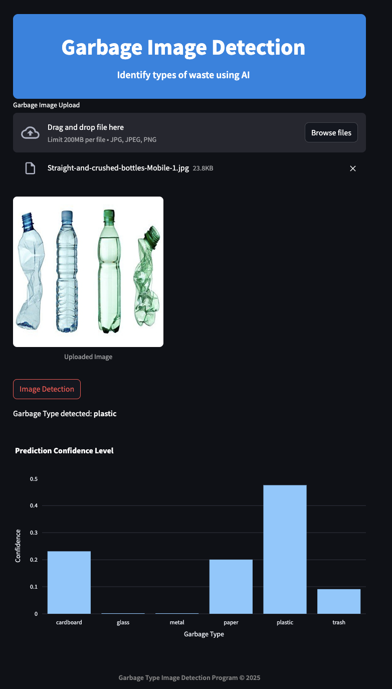

# 🗑️ Garbage Detection using YOLO

This project is a deep learning-based garbage detection system using **YOLOv8**. It detects garbage in images, helping in waste management and environmental monitoring.

## 🚀 Features
✅ Detects a single class of garbage in an image.
✅ Uses **YOLOv8** for object detection.
✅ Works with **Streamlit** for an interactive web app.
✅ Supports training on custom datasets.
✅ Outputs confidence levels as a bar chart.

---

## 📝 Installation

1️⃣ **Clone the Repository**
```bash
git clone https://github.com/diazprasetyo/garbage_classification_YOLO.git
cd garbage_classification_YOLO
```

2️⃣ **Install Dependencies**
```bash
pip install -r requirements.txt
```

3️⃣ **Pretrained YOLO Model**
Since the model (`best.pt`) is included in the repository, no additional download is needed.

---

## 📊 Training the YOLO Model

1️⃣ **Prepare Dataset** (Ensure images and labels are in `datasets/`)

2️⃣ **Run YOLO Training**
```bash
yolo task=detect mode=train model=yolov8m.pt data=config.yaml epochs=100 imgsz=640
```

---

## 🖥️ Running the Garbage Detection Web App

```bash
streamlit run app.py
```

🔹 Upload an image 📷 and get real-time detections with a confidence level bar chart.

---

## 📌 Example Output


---

## 🤝 Contributing
1. Fork the repo 🍴
2. Create a new branch (`git checkout -b feature-name`)
3. Commit your changes (`git commit -m "Add new feature"`)
4. Push to GitHub (`git push origin feature-name`)
5. Open a pull request 🚀

---

## 🐝 License
This project is open-source under the **MIT License**.

---

### 💎 Contact
For any questions, reach out at [diazadiprasetyo@gmail.com](mailto:diazadiprasetyo@gmail.com).
